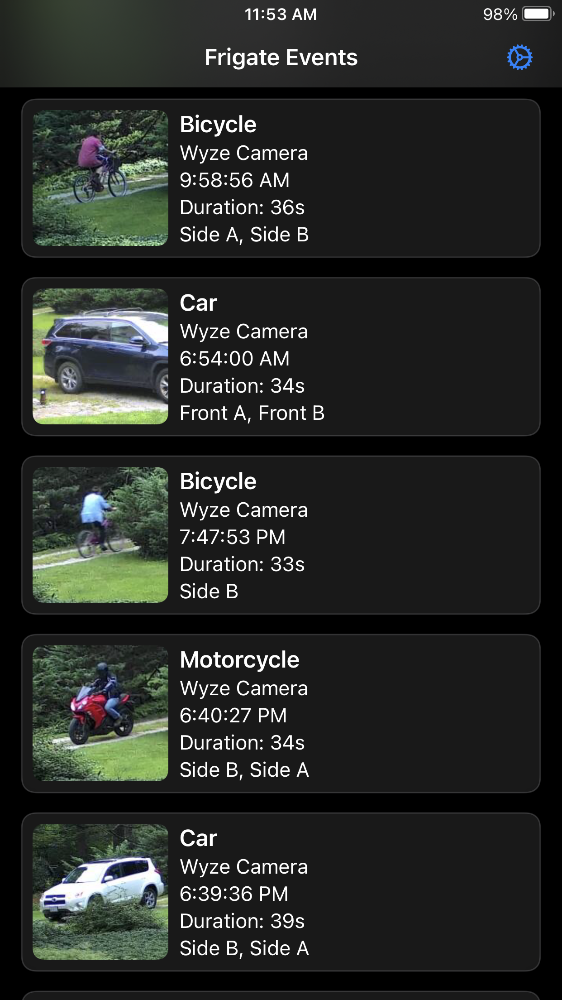
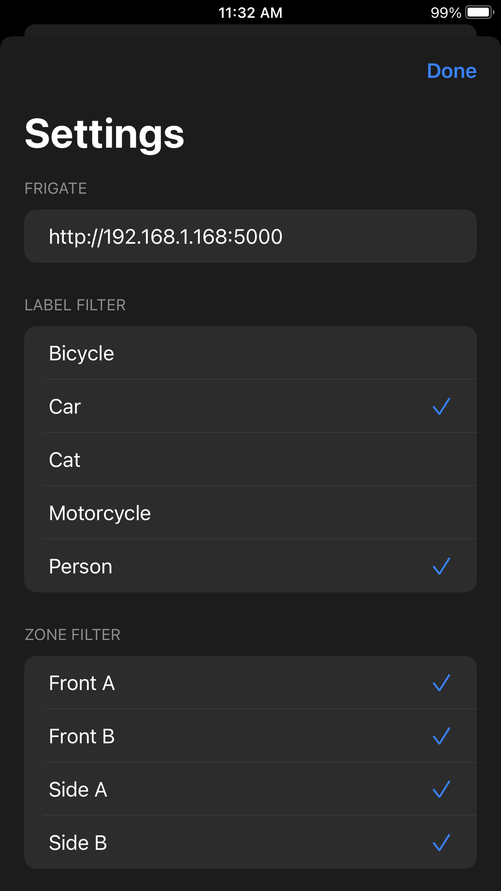
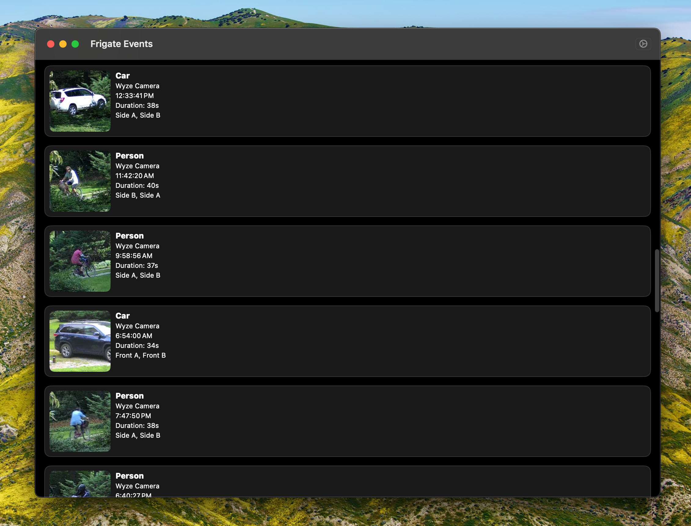
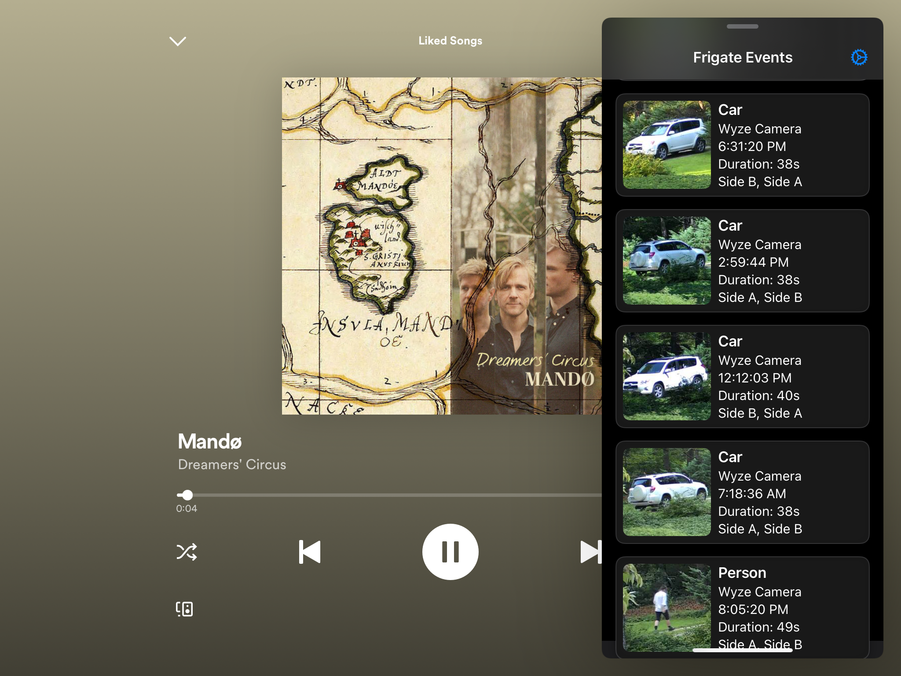
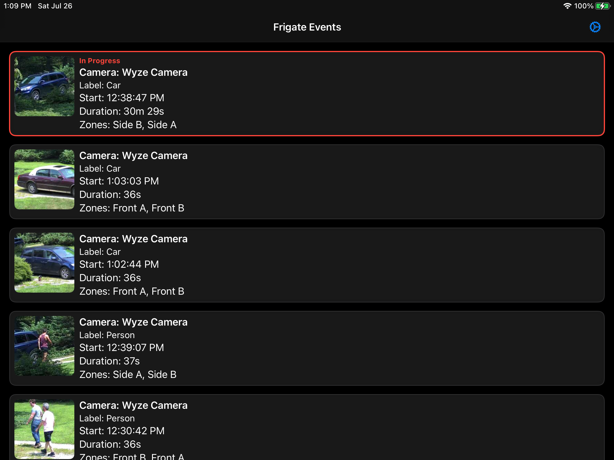

# Frigate Events

A native iOS and macOS application for monitoring and managing Frigate home surveillance events. Built with SwiftUI, this app provides real-time access to your security camera events, clips, and snapshots with an intuitive mobile interface.

## Features

- **Real-time Event Monitoring**: View live and completed security events from your Frigate cameras
- **Long Press Events**: Long press on any event and get more detailed information about the event
- **Smart Filtering**: Filter events by camera, detection labels, and zones
- **Event Management**: Access thumbnails, full-size snapshots, and video clips
- **Responsive Design**: Optimized for iOS devices with dark theme support
- **Offline Capability**: View cached events when network connectivity is limited

## Screenshots

<div align="center">

  
  
  
  
  
  

</div>

## Requirements

- iOS 14.6+ / macOS 12.0+ (Catalyst)
- Xcode 13.0+
- Swift 5.5+
- Active Frigate instance with API access

## Installation

### Prerequisites

1. Ensure you have a running Frigate instance with API enabled
2. Note your Frigate server's base URL (e.g., `http://192.168.1.100:5000`)

### Building from Source

1. Clone the repository:
   ```bash
   git clone https://github.com/yourusername/frigate-events.git
   cd frigate-events
   ```

2. Open the project in Xcode:
   ```bash
   open "Frigate Events.xcodeproj"
   ```

3. Configure your Frigate server URL in the app settings

4. Build and run on your device or simulator

## Configuration

### Initial Setup

1. Launch the app for the first time
2. Navigate to Settings
3. Enter your Frigate server's base URL
4. Configure notification preferences
5. Select default cameras, labels, and zones to monitor

### API Configuration

The app communicates with Frigate using the following endpoints:
- `GET /api/events` - Retrieve security events
- `GET /api/events/{id}/thumbnail.jpg` - Event thumbnails
- `GET /api/events/{id}/snapshot.jpg` - Full-size snapshots
- `GET /api/events/{id}/clip.mp4` - Video clips
- `GET /api/cameras` - Available cameras
- `GET /api/zones` - Defined zones

## Usage

### Viewing Events

- **In-Progress Events**: Real-time events currently being recorded
- **Completed Events**: Historical events with full metadata
- **Event Details**: Tap any event to view full information and media

### Filtering and Search

- **Camera Filter**: Focus on specific cameras
- **Label Filter**: Filter by detection type (person, car, animal, etc.)
- **Zone Filter**: Limit events to specific surveillance zones
- **Time Range**: View events from specific time periods

### Media Access

- **Thumbnails**: Quick preview of detected objects
- **Snapshots**: High-resolution images for detailed analysis
- **Video Clips**: Full motion recordings of events

## Architecture

### Core Components

- **FrigateAPIClient**: Handles all API communication with Frigate
- **SettingsStore**: Manages user preferences and configuration
- **EventCardView**: Displays event summaries in the main list
- **EventDetailView**: Shows comprehensive event information
- **VideoPlayerView**: Handles video playback for event clips

### Data Models

- **FrigateEvent**: Core event structure with metadata
- **EventData**: Additional detection information and bounding boxes
- **SettingsStore**: User preferences and configuration state

## Development

### Project Structure

```
Frigate Events/
├── Frigate_EventsApp.swift      # Main app entry point
├── ContentView.swift            # Primary view controller
├── FrigateAPIClient.swift      # API communication layer
├── FrigateEvent.swift          # Data models
├── EventCardView.swift         # Event list item views
├── EventDetailView.swift       # Detailed event view
├── VideoPlayerView.swift       # Video playback
├── SettingsView.swift          # Configuration interface
├── SettingsStore.swift         # Settings persistence
├── ImageLoader.swift           # Image loading utilities
└── SnapshotView.swift          # Snapshot display
```

### Key Technologies

- **SwiftUI**: Modern declarative UI framework
- **Combine**: Reactive programming for data binding
- **URLSession**: Network communication
- **UserNotifications**: Push notification support
- **Core Data**: Local data persistence (if implemented)

## Contributing

We welcome contributions to improve Frigate Events. Please follow these guidelines:

1. Fork the repository
2. Create a feature branch (`git checkout -b feature/amazing-feature`)
3. Commit your changes (`git commit -m 'Add amazing feature'`)
4. Push to the branch (`git push origin feature/amazing-feature`)
5. Open a Pull Request

### Development Guidelines

- Follow Swift style guidelines
- Add appropriate error handling
- Include unit tests for new functionality
- Update documentation for API changes
- Test on multiple iOS versions

## Troubleshooting

### Common Issues

**Connection Errors**
- Verify your Frigate server is running and accessible
- Check network connectivity and firewall settings
- Ensure the API endpoint is correct

**No Events Displayed**
- Verify camera names match your Frigate configuration
- Check that events exist for the selected time range
- Ensure proper API permissions

**Media Not Loading**
- Verify media files exist on the Frigate server
- Check network bandwidth for large files
- Ensure proper authentication if required

## License

This project is licensed under the MIT License - see the [LICENSE](LICENSE) file for details.

## Acknowledgments

- Built for the [Frigate](https://github.com/blakeblackshear/frigate) home surveillance platform
- Developed with SwiftUI and modern iOS development practices
- Community-driven development and feedback

## Support

For support and questions:
- Open an issue on GitHub
- Check the troubleshooting section above
- Review Frigate documentation for server-side issues

---

**Frigate Events** - Bringing your security monitoring to your fingertips.
